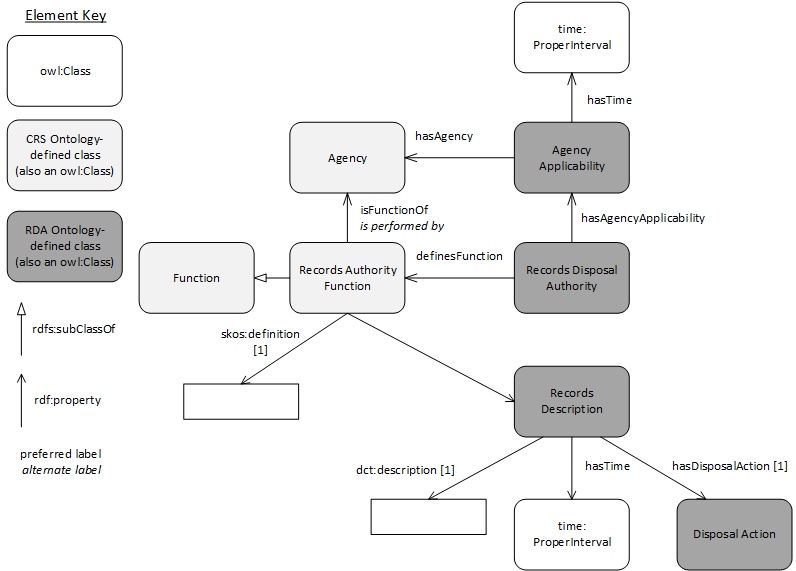

# Records Disposal Authority ontology

This ontology is an [OWL](https://www.w3.org/OWL/) interpretation of the structure of Records Disposal Authority documents and their corresponding database structured as the [National Archives of Australia](http://naa.gov.au). It is dependent on the [CRC Ontology](https://github.com/CSIRO-enviro-informatics/crs-ont) for overall context regarding Agencies and just models the RDA elements themselves.

  

**Figure 1**: RDA Ontology overview diagram  

***incomplete***

## License
This ontology and all other content in this repository are licensed under the [Creative Commons Attribution 4.0 International (CC BY 4.0)](https://creativecommons.org/licenses/by/4.0/) (local copy of deed: [LICENSE](LICENSE)).

## Contacts
Creator:  
**Nicholas Car**  
*Senior Experimental Scientist*  
CSIRO Land & Water, Brisbane, Australia    
<nicholas.car@csiro.au>  
<http://orcid.org/0000-0002-8742-7730>  

Contributors:

**Tatiana Antsoupova**  
*a/g Assistant Director, Information Governance*  
Commonwealth Information Policy  
Collection Management  
National Archives of Australia  

**David Hearder**  
*a/g Assistant Director*  
Commonwealth Information Policy  
Collection Management  
National Archives of Australia  
